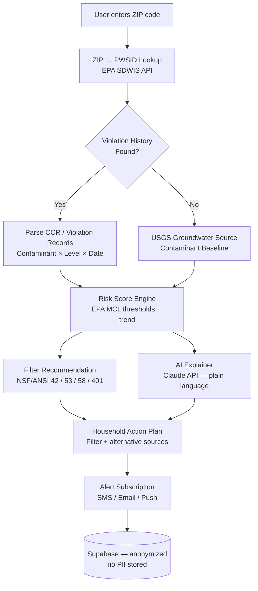

<p align="center">
  <h1 align="center">mama-water-shield</h1>
  <h3 align="center"><em>Enter your ZIP. See what's in your tap water. Find the right filter.</em></h3>
</p>

<p align="center">
  <a href="LICENSE"></a>
  
  
  <a href="https://mama.oliwoods.ai"></a>
  <a href="https://mama.oliwoods.ai/foundation"></a>
</p>

---

> *"77 million Americans — nearly 1 in 4 — are served by water systems that violated federal health standards at least once in the past decade."*
> — EPA Safe Drinking Water Act Violation Reports, 2023

---

## Why This Exists

The Safe Drinking Water Act was signed 50 years ago. We still can't tell most people what's actually in their glass.

- **Lead is everywhere.** The EPA estimates 6–10 million homes still have lead service lines. Lead causes irreversible neurological damage in children at any exposure level (CDC, 2021).
- **Violations go unannounced.** EPA data shows utilities sent late or no public notifications in 56% of health-based violations between 2016–2021 (NRDC, *Watered Down Justice*, 2021).
- **Filters only work if you pick the right one.** NSF/ANSI certifications span 70+ contaminant classes. Without matching contaminant to certification, a filter can make things worse.
- **Low-income communities bear the highest risk.** The 10 worst-performing water utilities disproportionately serve communities of color and rural poverty (EPA Environmental Justice analysis, 2022).

MAMA Water Shield surfaces EPA's own Consumer Confidence Report data, cross-references USGS contaminant mapping, and gives every household a plain-language risk score plus a certified filter recommendation — free, in 30 seconds, in 15+ languages.

---

## System Architecture



---

## Features & Modules

| Module | What It Does |
|---|---|
| **ZIP → Water System Lookup** | Maps any US ZIP to its EPA Public Water System ID (PWSID) via SDWIS |
| **Violation History Parser** | Pulls MCL violations, monitoring failures, and treatment technique violations back 10 years |
| **Real-Time Contaminant Map** | USGS + EPA overlay: lead, nitrates, PFAS, arsenic, disinfection byproducts |
| **Risk Score Engine** | Compares detected levels against EPA MCLs and WHO guidelines; outputs 0–100 household risk score |
| **Filter Recommender** | Matches contaminant profile to NSF/ANSI certification (42, 53, 58, 401, 473, 477) |
| **AI Plain-Language Explainer** | Claude-powered: turns regulatory jargon into 3-sentence household action steps |
| **Violation Alert System** | Subscribes households to real-time EPA boil-water and Do Not Use alerts by PWSID |
| **Offline Mode** | Caches last-known risk data; works in low-connectivity rural areas |
| **Multi-Language** | 15+ languages with cultural adaptation for immigrant communities |

---

## Quick Start

```bash
git clone https://github.com/OliWoods-Org/mama-water-shield.git
cd mama-water-shield
npm install
cp .env.example .env   # add EPA_API_KEY and SUPABASE_URL
npm run dev
```

Environment variables needed:
- `EPA_SDWIS_API_KEY` — [register free at EPA](https://www.epa.gov/enviro/web-services)
- `SUPABASE_URL` + `SUPABASE_ANON_KEY` — your Supabase project
- `ANTHROPIC_API_KEY` — for AI plain-language explainer
- `TWILIO_*` — optional, for SMS violation alerts

---

## Tech Stack

- **Runtime:** Node.js + TypeScript
- **Validation:** Zod schemas
- **Database:** Supabase (PostgreSQL) — anonymized, no PII
- **AI:** Claude API / local LLM (offline fallback)
- **Data Sources:** EPA SDWIS, USGS National Water Information System, NSF International
- **Alerts:** Twilio (SMS/WhatsApp), Resend (email), Web Push

---

## Research Citations

1. **EPA SDWIS Federal Reports** — Safe Drinking Water Information System violation database. [epa.gov/enviro/sdwis-search](https://www.epa.gov/enviro/sdwis-search)
2. **NRDC (2021).** *Watered Down Justice.* Lead service line and violation rate analysis by income and race. [nrdc.org/resources/watered-down-justice](https://www.nrdc.org/resources/watered-down-justice)
3. **CDC (2021).** *Blood Lead Reference Value.* No safe level of lead exposure for children. [cdc.gov/nceh/lead](https://www.cdc.gov/nceh/lead/prevention/blood-lead-levels.htm)
4. **EPA (2022).** *PFAS Strategic Roadmap.* PFAS contamination in US public water systems. [epa.gov/pfas](https://www.epa.gov/pfas/pfas-strategic-roadmap-epas-commitments-action-2021-2024)
5. **NSF International (2023).** *NSF/ANSI 53 — Drinking Water Treatment Units: Health Effects.* Certified contaminant reduction standards.

---

## Contributing

We welcome contributions — especially from water utility engineers, public health researchers, and community advocates.

1. Fork the repo
2. Create a feature branch (`git checkout -b feat/amazing-feature`)
3. Commit your changes
4. Push and open a PR

Issues tagged `good-first-issue` are beginner-friendly. Issues tagged `data-quality` need domain expertise — EPA data is messy and your help matters.

---

## License

AGPL-3.0 — Free to use, modify, and distribute. If you build on this, your improvements must remain open source.

---

<p align="center">
  <strong>Built by the <a href="https://oliwoods.ai">OliWoods Foundation</a></strong><br>
  <em>Free forever. Open source. Because clean water is a right, not a subscription.</em>
</p>
